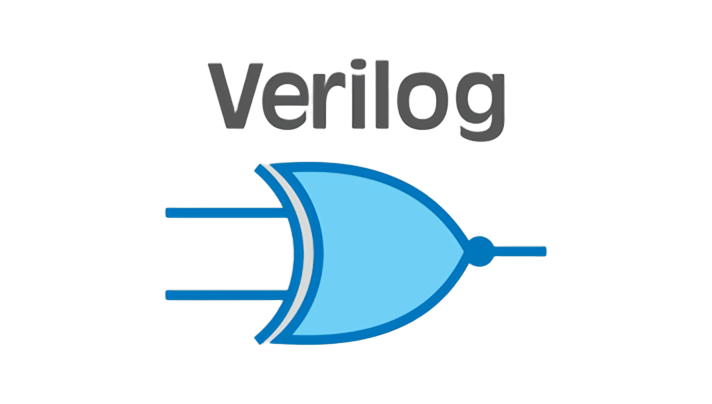
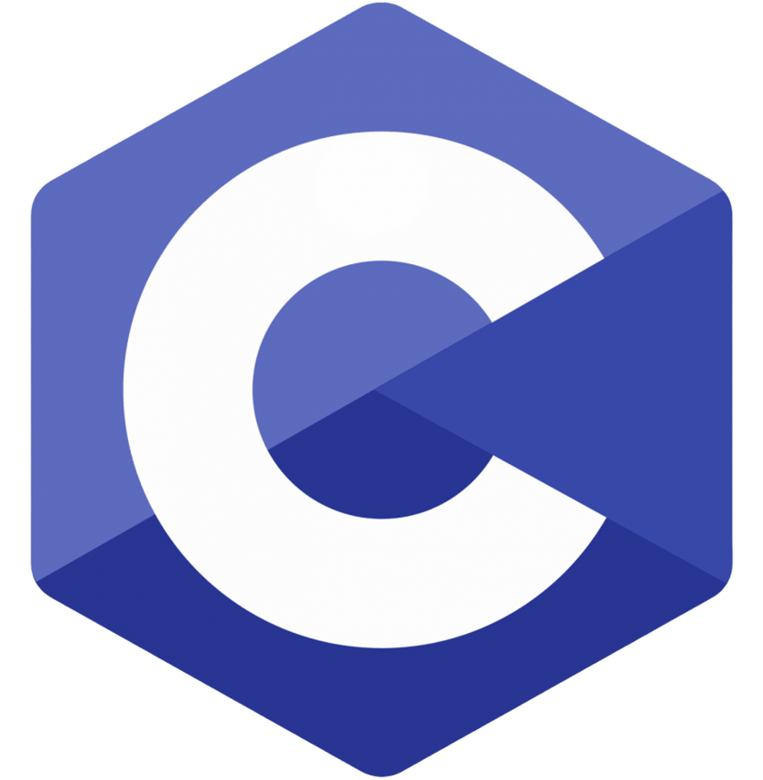
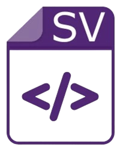
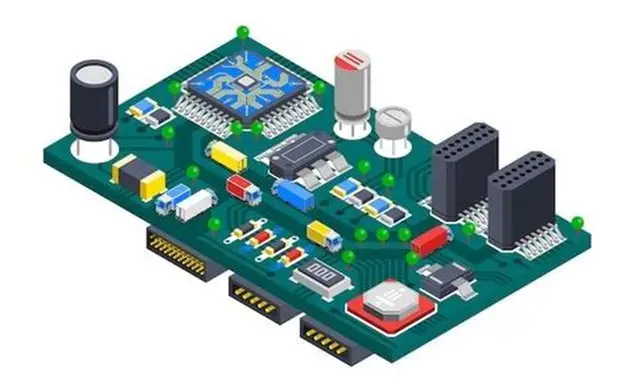
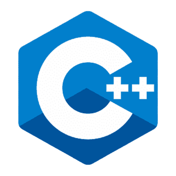
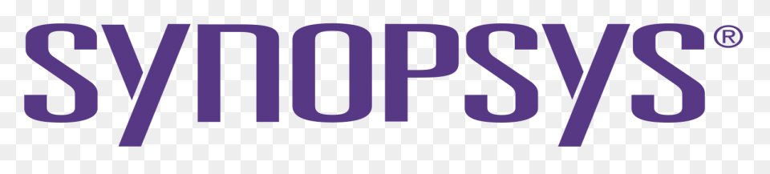
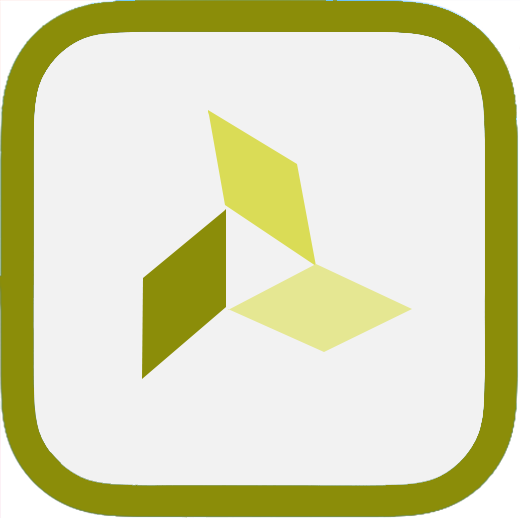
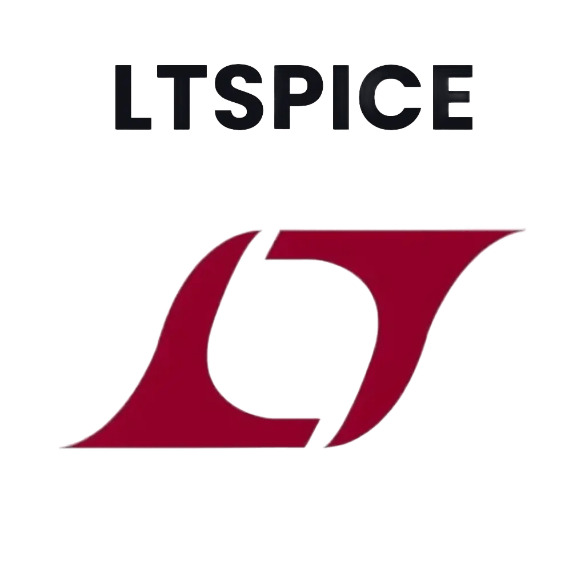

<div align="center">


<br/>

[](https://git.io/typing-svg)

<br/>

[](https://www.linkedin.com/in/navnofficial)
[](https://github.com/Navnofficial)
[](mailto:navnofficial@gmail.com)

</div>

---

<div align="center">

```
  B.E. Electronics Engineering · VLSI Design & Technology
  Rajalakshmi Institute of Technology, Chennai   ·   CGPA 8.76   ·   2023–2027    ·   he 
```

</div>

---

<h2>&nbsp; What I Build</h2>

<div align="center">
<table>
<tr>
<td align="center" width="33%">
<br/><br/>
<b>Silicon</b><br/>
<sub>RTL design · RISC-V · SoC architecture · FPGA · digital circuits</sub>
</td>
<td align="center" width="33%">
<br/><br/>
<b>Embedded</b><br/>
<sub>Firmware · LiDAR drivers · motor control · microcontrollers · real-time systems</sub>
</td>
<td align="center" width="33%">
<br/><br/>
<b>Connected</b><br/>
<sub>IoT · ESP32 · Raspberry Pi · Azure Cloud · AI edge analytics</sub>
</td>
</tr>
</table>
</div>

---

<h2>&nbsp; Experience</h2>

<table>
<tr>
<td valign="top">

**Susan Future Technologies** &nbsp;·&nbsp; Project Intern &nbsp;&nbsp;`Oct 2025 – Present`<br/>
Developed embedded C firmware and a modular **LiDAR driver** on TI board (Benewake LiDAR) for 3D mapping. Implemented motor control unit integration.

</td>
</tr>
<tr><td><br/></td></tr>
<tr>
<td valign="top">

**Spinacle Technologies** &nbsp;·&nbsp; R&D Intern &nbsp;&nbsp;`Jan 2025 – Jun 2025`<br/>
Built **Gut Health IoT monitoring** systems using Raspberry Pi 5 and ESP32 with Microsoft **Azure Cloud** for real-time data pipeline.

</td>
</tr>
<tr><td><br/></td></tr>
<tr>
<td valign="top">

**Spinacle Technologies** &nbsp;·&nbsp; Project Intern &nbsp;&nbsp;`Apr 2024 – May 2024`<br/>
ESP32-based **audio monitoring system** with real-time capture, Azure upload, and AI-driven pattern analysis with live notifications.

</td>
</tr>
</table>

---

<h2>&nbsp; Projects</h2>

<div align="center">

| Project | Stack | Year |
|:---|:---|:---:|
| **[serv-soc-fpga](https://github.com/Navnofficial/serv-soc-fpga)**<br/><sub>Full RISC-V SoC on $4 FPGA · SERV CPU, 4KB RAM, UART via Wishbone, RP2040 bootloader</sub> | `Verilog` `RISC-V` `FPGA` | 2025 |
| **[RISC-V-Single-Cycle](https://github.com/Navnofficial/RISC-V-Single-Cycle)**<br/><sub>RV32I single-cycle processor · full datapath, control logic, ALU, register file</sub> | `Verilog` `C` | 2026 |
| **[FPGA-Shirk_Lite](https://github.com/Navnofficial/FPGA-Shirk_Lite)**<br/><sub>Verilog HDL collection for Vicharak Shrike FPGA · blink, mux, counter, adder</sub> | `Verilog` `Tcl` | 2025 |
| **[EMG-CoreX](https://github.com/Navnofficial/EMG-CoreX)**<br/><sub>SoC for ultra-low-latency edge gesture recognition · precision Analog Front End (AFE)</sub> | `SystemVerilog` `SoC` | 2025 |
| **[Digital_Design](https://github.com/Navnofficial/Digital_Design)**<br/><sub>Collection of digital design projects — combinational & sequential circuits for VLSI coursework</sub> | `Verilog` `VLSI` | 2025 |
| **[nvm-industrial-monitor](https://github.com/Navnofficial/nvm-industrial-monitor)**<br/><sub>Verilog-based real-time industrial hardware monitoring system</sub> | `Verilog` | 2025 |
| **[Mento-Band](https://github.com/Navnofficial/Mento-Band)**<br/><sub>AI wearable · biosignal monitoring for sports injury prediction & performance</sub> | `IoT` `AI` | 2025 |
| **[Muscle_Sync](https://github.com/Navnofficial/Muscle_Sync)**<br/><sub>MuscleSync is an IoT project that captures EMG (Electromyography) muscle electrical signals through a surface electrode sensor, processes them on an Arduino microcontroller, and maps the classified gesture states to real-time keyboard inputs on a connected PC </sub> | `Python` `IoT` | 2024 |
| **[Sky_Fi](https://github.com/Navnofficial/Sky-Fi)**<br/><sub>Sky-Fi is a Wi-Fi controlled FPV (First Person View) RC airplane powered by an ESP32 microcontroller </sub> | `Python` `IoT` | 2024 |
| **[PCB-Design](https://github.com/Navnofficial/PCB-Design)**<br/><sub>Schematics and layouts bridging digital logic to physical hardware</sub> | `EasyEDA` | 2025 |
| **[Pi-Flutter-SSH](https://github.com/Navnofficial/Integrating-Pi-With-Flutter-Over-SSH)**<br/><sub>Flutter app controlling Pi live-stream + audio analysis over SSH</sub> | `Dart` `Flutter` | 2025 |
| **[Microprocessor](https://github.com/Navnofficial/Microprocessor)**<br/><sub>8085 / 8086 assembly programs and interfacing experiments</sub> | `Assembly` | 2025 |
| **[Software-Projects](https://github.com/Navnofficial/Software-Projects)**<br/><sub>Miscellaneous software builds — web apps, utilities, and UI experiments</sub> | `HTML` `CSS` `JS` | 2024 |
| **[Bootcamp_NIELIT](https://github.com/Navnofficial/Bootcamp_NIELIT)**<br/><sub>NIELIT embedded systems bootcamp — exercises, assignments, and project work</sub> | `C` `Embedded` | 2024 |
| **[Portfolio](https://github.com/Navnofficial/Portfolio)**<br/><sub>Personal portfolio website — dark glassmorphism theme with interactive UI</sub> | `HTML` `CSS` `JS` | 2025 |

</div>

---

<h2>&nbsp; Tech Stack</h2>

<div align="center">

### Hardware & RTL

&nbsp;
&nbsp;
&nbsp;
&nbsp;
&nbsp;


### Languages

&nbsp;
&nbsp;
&nbsp;


### EDA & Simulation Tools

&nbsp;&nbsp;
&nbsp;&nbsp;
&nbsp;
&nbsp;
&nbsp;


### Platforms & Tools

&nbsp;
&nbsp;
&nbsp;
&nbsp;


</div>

---

<h2>&nbsp; Recognition</h2>

<div align="center">

<table>
<tr>
<td align="center" valign="top" width="50%">

**Certifications**

Digital Circuits — NPTEL<br/>
Microprocessor & Microcontroller — NPTEL<br/>
System Design through Verilog — NPTEL<br/>
Embedded for Beginners — NIELIT

</td>
<td align="center" valign="top" width="50%">

**Hackathons & Expos**

Smart India Hackathon *(Finalist)*<br/>
Lam Research Talent Challenge<br/>
Smart Innovators Hackathon<br/>
Circuit Design · Techgium<br/>
Young Innovators Project Expo

</td>
</tr>
</table>

</div>

---

<div align="center">


</div>
